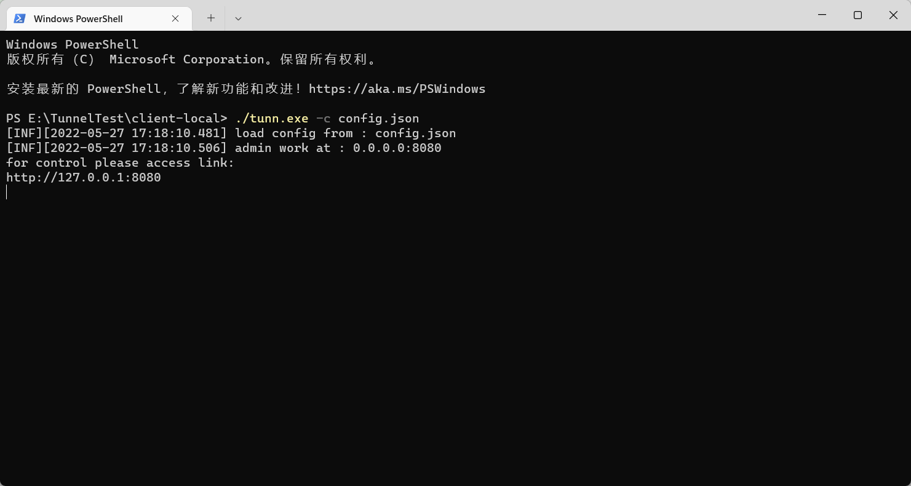
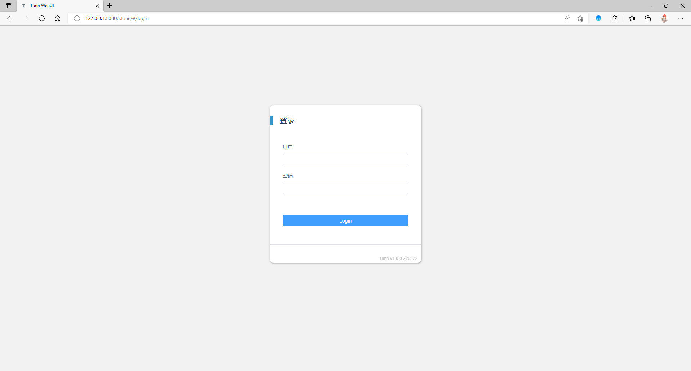
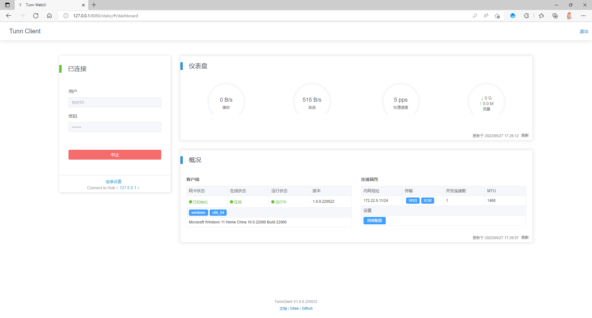

# Tunn - NetworkTunnel

<br>

[中文文档](./doc/README_CN.md) | [English](./doc/README_EN.md)

The purpose of this project is to implement the high-speed, safe and high-quality cross network connection. The virtual
LAN environment is provided for users by creating a network tunnel. It supports multiple platforms, multiple
transmission protocols and encryption methods. It is applicable to simple remote networking and other scenarios.

<br>
<br>
<br>

### Features

--------

#### supported os

tested：

- Windows 7/10/11
- CentOS 7.x
- Ubuntu 20.x

may support：

- Windows 7+
- Linux release supports tun device

#### supported transmit protocols

TCP / KCP / WS / WSS

#### supported encryption methods

AES256 / AES192 / AES128 / XOR / SM4 / TEA / XTEA / Salsa20 / Blowfish

### Updates

------

2022/05/27 @ 1.0.0.220527

- WebUI
- automatic import system route table
- config from client

2022/05/10 @ 0.0.1

- detached from project [Tunnel](https://gitee.com/jackrabbit872568318/tunnel)

2022/05/09 @ history

- work in NAT network
- windows support
- packet CRC32 checksum
- ws/wss/tcp/kcp support
- network export / import
- multi connection
- data encrypt
- ...

### Compile

------

Needs Go1.18.2 or higher [download](https://golang.google.cn/dl/)

Prepare

```shell
#clone repository
git clone https://gitee.com/jackrabbit872568318/tunn.git

#into repository directory
cd ./tunn

#download dependencies
set GO111MODULE=on
go mod tidy

#into cmd directory
cd cmd
```

Compile

```shell
# @linux
go build -o tunn
```

or

```shell
# @windows
go build -o tunn.exe
```

### Use

------

#### Client config example

[Config File](../config/config_full.json)

```json lines
{
  "user": {
    //Hub account
    "Account": "account",
    //Hub password (auto login if password were set)
    "Password": "password"
  },
  "auth": {
    //authentication server address
    "Address": "aaa.bbb.ccc",
    //authentication server port
    "Port": 10241
  },
  "security": {
    //Hub certification
    "cert": "cert.pem"
  },
  "admin": {
    //admin address
    "address": "127.0.0.1",
    //admin port
    "port": 8080,
    //admin user
    "user": "admin",
    //admin password
    "password": "P@ssw0rd"
  }
}
```

#### Startup

Start parameters

- -c set witch config should load

Example:

```shell
# @linux
./tunn -c config.json
```

or

```shell
# @windows
tunn.exe -c config.json
```

Start up successfully like this



Open your browser


Enter dashboard
